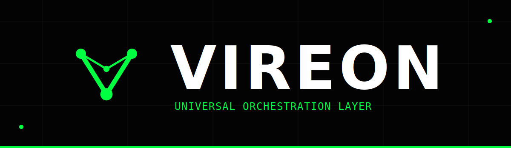
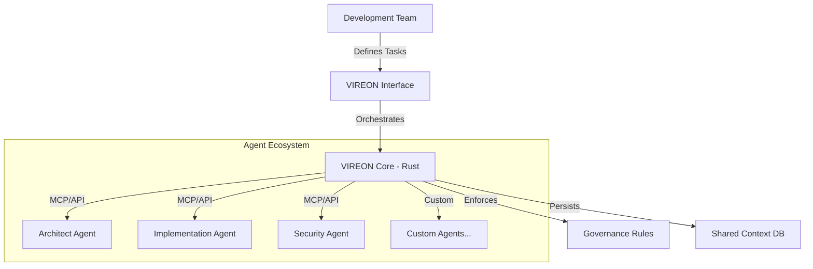

# VIREON: Universal Agentic Orchestration

<div align="center">



[](https://www.rust-lang.org/)
[](https://www.python.org/)
[](https://modelcontextprotocol.io)
[](./LICENSE)
[](https://github.com/symbeon-labs/vireon)

**The Orchestration Layer for Distributed Intelligence.**

*Governance, Coordination, and Synergy for Multi-Agent Systems.*

[📖 Documentation](./docs/) | [💬 Discussions](https://github.com/symbeon-labs/vireon/discussions) | [🚀 Quick Start](#-quick-start)

</div>

<div align="center">
  
</div>

---

## ⚡ The Vision

We are entering the **Age of Distributed Intelligence**. Modern workflows don't rely on a single AI assistant—they orchestrate multiple specialized agents across different domains. However, these agents operate in isolated silos, each with its own context, capabilities, and blind spots.

**VIREON** solves this fragmentation. It is a **Universal Orchestration Layer** that transforms disconnected AI agents into a coordinated, governed, and self-improving ecosystem—**regardless of their underlying provider, model, or protocol**.

> "From scattered tools to unified intelligence. From chaos to orchestration."

---

## 🔥 Core Capabilities

### 🌐 1. Universal Protocol Support (MCP & Beyond)

VIREON implements open standards like the **Model Context Protocol (MCP)**, enabling it to serve as a central orchestration hub for any compliant agent ecosystem.

- **Unified Context:** Share knowledge, state, and history across all agents instantly.
- **Protocol Bridging:** Connect agents from different providers using a single interface.
- **Provider Agnostic:** Works with Anthropic, OpenAI, local LLMs, custom agents, and future platforms.

### 🚀 2. Hybrid Architecture (Rust + Python)

Built for speed, styled for flexibility.

- **Rust Core:** Handles the heavy lifting—high-performance rule enforcement and context switching.
- **Python Interface:** Easy adoption for DS/ML teams to write custom orchestration logic.

### 🧠 3. Governance Engine with Self-Correction

VIREON doesn't just route messages; it *governs* them.

- **Symbiotic Feedback Loop:** Monitors agent outputs for quality and consistency.
- **Adaptive Rules:** Enforce policies like "no commits without tests" or "consensus required for deployments".
- **Hallucination Detection:** Built-in safeguards against model drift and unreliable outputs.

---

## 🏗️ System Architecture



---

## 🚀 Quick Start

### Prerequisites

- Rust 1.70+
- Python 3.11+
- Docker (Optional)

### Installation

```bash
# 1. Clone the repository
git clone https://github.com/symbeon-labs/vireon.git
cd vireon

# 2. Setup Virtual Environment
python -m venv .venv
source .venv/bin/activate  # Windows: .venv\Scripts\activate

# 3. Install Dependencies
pip install pyyaml pydantic

# 4. Run Example
python examples/basic_swarm.py
```

###Usage Example

```python
from vireon import VireonCore

# Initialize with config
vireon = VireonCore(config="./vireon.yaml")

# Orchestrate multiple agents
result = await vireon.swarm_execute(
    task="Refactor authentication module",
    agents=[
        "architect-agent",       # High-level design
        "implementation-agent",  # Code changes
        "security-agent"         # Vulnerability assessment
    ]
)

print(f"Consensus: {result.consensus}")
print(f"Confidence: {result.confidence_score:.0%}")
```

---

## 💼 Enterprise Integration

VIREON is designed for **Zero-Trust, Multi-Vendor Environments**.

| Feature | Description |
| :--- | :--- |
| **Compliance Ready** | Full audit logs of every orchestration decision and agent interaction. |
| **Policy Enforcement** | Hard governance rules (e.g., "No deploys without 3-agent consensus"). |
| **Air-Gap Deployment** | Run completely offline with local LLMs (Llama, Mistral, proprietary models). |
| **Vendor Independence** | Avoid provider lock-in—orchestrate any combination of commercial or open-source agents. |

---

## � Use Cases

### Software Development Teams
- **Multi-Model Code Review:** Combine strengths from different LLMs (e.g., GPT-4 for logic, Claude for safety, local for privacy).
- **Continuous Quality Gates:** Enforce "no commits without tests" across AI-assisted workflows.
- **Knowledge Continuity:** Preserve context across sprints, team changes, and handoffs.

### Enterprise AI Operations
- **Cost Optimization:** Route tasks to the most cost-effective agent based on complexity and SLAs.
- **Vendor Diversification:** Mitigate risk by using multiple AI providers simultaneously.
- **Regulatory Compliance:** Full traceability for audited environments (healthcare, finance, defense).

### Research & Academia
- **Reproducible Experiments:** Config-driven agent ensembles for scientific reproducibility.
- **Bias Mitigation:** Use consensus mechanisms to identify and reduce model-specific biases.
- **Comparative Analysis:** Run identical queries across multiple models and analyze divergences.

---

## 🛣️ Roadmap

- **Q1 2025:** Full MCP Server implementation with IDE-agnostic plugins.
- **Q2 2025:** Self-Improving Governance (agents learn from historical decisions).
- **Q3 2025:** Enterprise SaaS offering with multi-tenancy and RBAC.
- **2026:** Open Federation Protocol for cross-organization agent sharing.

---

## 🤝 Contributing

We are building the **infrastructure for the Agentic Era**. Join us in defining how distributed intelligence operates at scale.

1. Read [CONTRIBUTING.md](./CONTRIBUTING.md) for guidelines
2. Join discussions on [GitHub Discussions](https://github.com/symbeon-labs/vireon/discussions)
3. Submit PRs (Convention: **Logic in Rust, Glue in Python**)

---

<div align="center">

**Architected by [SH1W4](https://github.com/SH1W4) (Symbiotic Human-AI Workflow Architect) // Symbeon Labs**

*"The future is not a tool, but an ecosystem."*  
*[EAP Roadmap](./EAP_ROADMAP.md) | [Architecture Docs](./docs/)*

</div>
