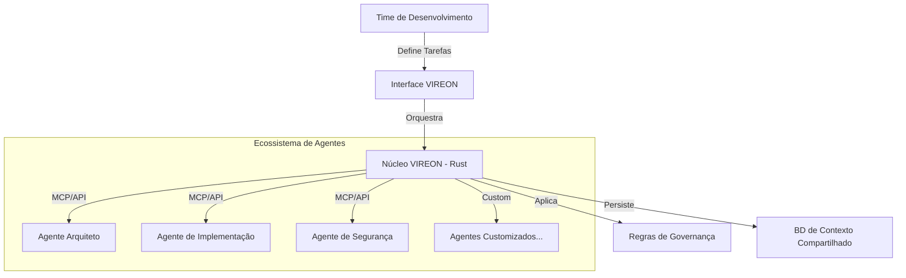

[🇺🇸 English](./README.md) | **🇧🇷 Português**

# VIREON: Orquestração Universal de Agentes

<div align="center">


[](https://www.rust-lang.org/)
[](https://www.python.org/)
[](https://modelcontextprotocol.io)
[](./LICENSE)
[](https://github.com/symbeon-labs/vireon)

**A Camada de Orquestração para Inteligência Distribuída.**

*Governança, Coordenação e Sinergia para Sistemas Multi-Agentes.*

[📖 Documentação](./docs/) | [💬 Discussões](https://github.com/symbeon-labs/vireon/discussions) | [🚀 Início Rápido](#-início-rápido)

</div>

<div align="center">
  
</div>

---

## ⚡ A Visão

Estamos entrando na **Era da Inteligência Distribuída**. Fluxos de trabalho modernos não dependem de um único assistente de IA — eles orquestram múltiplos agentes especializados em diferentes domínios. No entanto, esses agentes operam em silos isolados, cada um com seu próprio contexto, capacidades e pontos cegos.

**VIREON** resolve essa fragmentação. É uma **Camada de Orquestração Universal** que transforma agentes de IA desconectados em um ecossistema coordenado, governado e auto-aperfeiçoável — **independentemente de seu provedor, modelo ou protocolo subjacente**.

> "De ferramentas dispersas para inteligência unificada. Do caos para a orquestração."

---

## 🔥 Capacidades Principais

### 🌐 1. Suporte a Protocolo Universal (MCP e Além)

O VIREON implementa padrões abertos como o **Model Context Protocol (MCP)**, permitindo que ele sirva como um hub central de orquestração para qualquer ecossistema de agentes compatível.

- **Contexto Unificado:** Compartilhe conhecimento, estado e histórico entre todos os agentes instantaneamente.
- **Ponte de Protocolos:** Conecte agentes de diferentes provedores usando uma interface única.
- **Agnóstico de Provedor:** Funciona com Anthropic, OpenAI, LLMs locais, agentes customizados e plataformas futuras.

### 🚀 2. Arquitetura Híbrida (Rust + Python)

Construído para velocidade, estilizado para flexibilidade.

- **Núcleo em Rust:** Lida com o trabalho pesado — aplicação de regras de alta performance e troca de contexto.
- **Interface em Python:** Fácil adoção para times de DS/ML escreverem lógica de orquestração personalizada.

### 🧠 3. Motor de Governança com Auto-Correção

O VIREON não apenas roteia mensagens; ele as *governa*.

- **Loop de Feedback Simbiótico:** Monitora as saídas dos agentes quanto à qualidade e consistência.
- **Regras Adaptativas:** Aplica políticas como "sem commits sem testes" ou "consenso necessário para deploys".
- **Detecção de Alucinação:** Salvaguardas integradas contra desvio de modelo e saídas não confiáveis.

---

## 🏗️ Arquitetura do Sistema



---

## 🚀 Início Rápido

### Pré-requisitos

- Rust 1.70+
- Python 3.11+
- Docker (Opcional)

### Instalação

```bash
# 1. Clone o repositório
git clone https://github.com/symbeon-labs/vireon.git
cd vireon

# 2. Configure o Ambiente Virtual
python -m venv .venv
source .venv/bin/activate  # Windows: .venv\Scripts\activate

# 3. Instale Dependências
pip install pyyaml pydantic

# 4. Execute o Exemplo
python examples/basic_swarm.py
```

### Exemplo de Uso

```python
from vireon import VireonCore

# Inicialize com configuração
vireon = VireonCore(config="./vireon.yaml")

# Orquestre múltiplos agentes
result = await vireon.swarm_execute(
    task="Refatorar módulo de autenticação",
    agents=[
        "architect-agent",       # Design de alto nível
        "implementation-agent",  # Mudanças de código
        "security-agent"         # Avaliação de vulnerabilidade
    ]
)

print(f"Consenso: {result.consensus}")
print(f"Confiança: {result.confidence_score:.0%}")
```

---

## 💼 Integração Enterprise

O VIREON é projetado para **Ambientes Zero-Trust e Multi-Vendor**.

| Recurso | Descrição |
| :--- | :--- |
| **Pronto para Compliance** | Logs de auditoria completos de cada decisão de orquestração e interação de agente. |
| **Aplicação de Políticas** | Regras de governança rígidas (ex: "Sem deploys sem consenso de 3 agentes"). |
| **Deploy Air-Gap** | Execute completamente offline com LLMs locais (Llama, Mistral, modelos proprietários). |
| **Independência de Fornecedor** | Evite lock-in de provedor — orquestre qualquer combinação de agentes comerciais ou open-source. |

---

## 💡 Casos de Uso

### Times de Desenvolvimento de Software
- **Revisão de Código Multi-Modelo:** Combine forças de diferentes LLMs (ex: GPT-4 para lógica, Claude para segurança, local para privacidade).
- **Quality Gates Contínuos:** Force "sem commits sem testes" em fluxos de trabalho assistidos por IA.
- **Continuidade de Conhecimento:** Preserve o contexto entre sprints, mudanças de time e handoffs.

### Operações de IA Enterprise
- **Otimização de Custos:** Roteie tarefas para o agente mais custo-efetivo baseado na complexidade e SLAs.
- **Diversificação de Fornecedores:** Mitigue riscos usando múltiplos provedores de IA simultaneamente.
- **Compliance Regulatório:** Rastreabilidade total para ambientes auditados (saúde, finanças, defesa).

### Pesquisa & Academia
- **Experimentos Reprodutíveis:** Conjuntos de agentes guiados por configuração para reprodutibilidade científica.
- **Mitigação de Viés:** Use mecanismos de consenso para identificar e reduzir vieses específicos de modelos.
- **Análise Comparativa:** Execute consultas idênticas em múltiplos modelos e analise divergências.

---

## 🛣️ Roadmap

- **Q1 2025:** Implementação completa do Servidor MCP com plugins agnósticos de IDE.
- **Q2 2025:** Governança Auto-Aperfeiçoável (agentes aprendem com decisões históricas).
- **Q3 2025:** Oferta Enterprise SaaS com multi-tenancy e RBAC.
- **2026:** Protocolo Aberto de Federação para compartilhamento de agentes entre organizações.

---

## 🤝 Contribuindo

Estamos construindo a **infraestrutura para a Era Agêntica**. Junte-se a nós para definir como a inteligência distribuída opera em escala.

1. Leia [CONTRIBUTING.md](./CONTRIBUTING.md) para diretrizes
2. Junte-se às discussões no [GitHub Discussions](https://github.com/symbeon-labs/vireon/discussions)
3. Envie PRs (Convenção: **Lógica em Rust, Cola em Python**)

---

<div align="center">

**Arquitetado por [SH1W4](https://github.com/SH1W4) (Arquiteto de Fluxo de Trabalho Simbiótico Humano-IA) // Symbeon Labs**

*"O futuro não é uma ferramenta, mas um ecossistema."*  
*[Roteiro EAP](./EAP_ROADMAP.md) | [Docs de Arquitetura](./docs/)*

</div>
