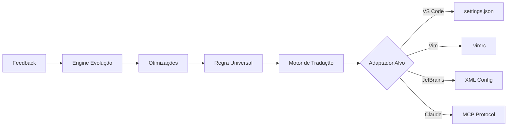

# VIREON: Sistema de Meta-Governança Universal para Agentes de IA

## Resumo Executivo

O VIREON é uma plataforma revolucionária que unifica a configuração e governança de todas as ferramentas de desenvolvimento, IDEs e agentes de IA em um único sistema inteligente.

**🎯 Objetivo Principal**: Eliminar a fragmentação de configurações entre ferramentas, permitindo que desenvolvedores definam suas preferências uma vez e as vejam aplicadas consistentemente em todo seu ambiente de trabalho.

**🔑 Características Principais**:
- **Universal**: Funciona com qualquer IDE, editor, agente IA ou ferramenta DevOps
- **Inteligente**: Aprende com o uso e sugere otimizações automaticamente
- **Seguro**: Criptografia end-to-end e isolamento de dados sensíveis
- **Evolutivo**: Melhora continuamente através de feedback e aprendizado

**📊 Resultados Esperados**:
- 80% de redução no tempo de configuração de ambientes
- 100% de consistência entre ferramentas do time
- 60% menos erros de configuração
- ROI em 3 meses para equipes médias

## Visão Geral

O **VIREON** é uma plataforma de meta-governança universal projetada para ser **agnóstica a ambientes**, capaz de se integrar e gerenciar regras, comportamentos e evolução de qualquer agente de IA, IDE ou ambiente de desenvolvimento.

### Problema que Resolve

Desenvolvedores modernos utilizam múltiplas ferramentas, IDEs e agentes de IA simultaneamente. Cada ferramenta possui seu próprio sistema de configuração, formato de regras e padrões de comportamento. O VIREON unifica essa fragmentação através de uma camada de abstração inteligente que:

- **Traduz** regras e configurações entre diferentes formatos
- **Sincroniza** comportamentos entre múltiplos ambientes
- **Evolui** de forma unificada, aplicando aprendizados globalmente
- **Preserva** a autonomia de cada ferramenta enquanto mantém consistência

### Como Funciona

1. **Descoberta Automática**: VIREON detecta todas as ferramentas instaladas
2. **Definição Universal**: Você define suas preferências uma única vez
3. **Tradução Inteligente**: As regras são traduzidas para cada ferramenta
4. **Sincronização Contínua**: Mudanças são propagadas automaticamente
5. **Evolução Adaptativa**: O sistema aprende e melhora com o uso

## Princípios de Design Universal

### 1. Agnosticismo de Plataforma

O VIREON opera como uma camada de abstração independente, sem dependências rígidas:

```
VIREON (Meta-Governança Universal)
    ├── Núcleo Universal
    │   ├── Motor de Regras
    │   ├── Sistema de Tradução
    │   ├── Engine de Evolução
    │   └── Protocolo de Comunicação
    └── Adaptadores Plugáveis
        ├── Terminais (Warp, iTerm2, Windows Terminal)
        ├── IDEs (VS Code, JetBrains, Vim, Emacs)
        ├── Agentes IA (Claude, GPT, Copilot, Gemini)
        ├── DevOps (Jenkins, GitHub Actions, GitLab CI)
        └── Extensível (SDK para novos adaptadores)
```

### 2. Arquitetura Modular e Extensível

```python
# Interface base para qualquer adaptador
class UniversalAdapter(ABC):
    """Adaptador base para integração com qualquer ambiente"""
    
    @abstractmethod
    async def connect(self, environment_config: Dict[str, Any]) -> bool:
        """Estabelece conexão com o ambiente específico
        
        Args:
            environment_config: Configurações específicas do ambiente
            
        Returns:
            bool: True se conectado com sucesso
        """
        pass
    
    @abstractmethod
    async def apply_rules(self, rules: List[Rule]) -> Dict[str, Any]:
        """Aplica regras traduzidas no contexto do ambiente
        
        Args:
            rules: Lista de regras universais VIREON
            
        Returns:
            Dict com status de aplicação e possíveis erros
        """
        pass
    
    @abstractmethod
    async def collect_feedback(self) -> Dict[str, Any]:
        """Coleta métricas e feedback para evolução adaptativa
        
        Returns:
            Dict com métricas de uso, performance e sugestões
        """
        pass
    
    @abstractmethod
    def get_capabilities(self) -> Dict[str, Any]:
        """Retorna capacidades e limitações do adaptador
        
        Returns:
            Dict descrevendo features suportadas
        """
        pass
```

## Componentes Universais

### 1. Sistema de Regras Agnóstico

```python
from enum import Enum
from typing import Dict, List, Any, Optional

class RuleScope(Enum):
    """Escopo de aplicação da regra"""
    GLOBAL = "global"          # Aplica em todos os ambientes
    ENVIRONMENT = "environment" # Específico por tipo de ambiente
    PROJECT = "project"        # Específico por projeto
    USER = "user"             # Preferências do usuário

class UniversalRule:
    """Regra que pode ser traduzida para qualquer ambiente"""
    
    def __init__(self, 
                 name: str,
                 content: Dict[str, Any], 
                 scope: RuleScope = RuleScope.GLOBAL,
                 priority: int = 0,
                 adapters: Optional[List[str]] = None):
        self.name = name
        self.content = content
        self.scope = scope
        self.priority = priority  # Maior prioridade sobrescreve menor
        self.supported_adapters = adapters or []  # [] = todos os adaptadores
        self.translations = {}  # Cache de traduções por ambiente
        self.metadata = {
            'created_at': datetime.now(),
            'version': '1.0',
            'author': 'system'
        }
    
    def translate_for(self, adapter_type: str, capabilities: Dict) -> Dict[str, Any]:
        """Traduz a regra considerando capacidades do adaptador"""
        if adapter_type in self.translations:
            return self.translations[adapter_type]
            
        # Gera tradução baseada nas capacidades do adaptador
        translation = self._generate_translation(adapter_type, capabilities)
        self.translations[adapter_type] = translation
        return translation
    
    def _generate_translation(self, adapter_type: str, capabilities: Dict) -> Dict:
        """Gera tradução inteligente baseada em capacidades"""
        # Lógica de tradução adaptativa aqui
        pass
```

### 2. Motor de Consciência Adaptativo

```python
class AdaptiveConsciousness:
    """Sistema de consciência que se adapta ao ambiente e aprende continuamente"""
    
    def __init__(self):
        self.environment_profiles = {}
        self.learning_patterns = {}
        self.universal_knowledge = KnowledgeBase()
        self.evolution_metrics = EvolutionMetrics()
        self.feedback_processor = FeedbackProcessor()
    
    def adapt_to_environment(self, env_type: str, env_characteristics: Dict):
        """Adapta consciência às características do ambiente"""
        profile = EnvironmentProfile(
            type=env_type,
            characteristics=env_characteristics,
            optimization_targets=self.infer_targets(env_characteristics),
            constraints=self.identify_constraints(env_characteristics)
        )
        self.environment_profiles[env_type] = profile
        
        # Aplica aprendizados prévios relevantes
        similar_profiles = self.find_similar_profiles(profile)
        if similar_profiles:
            self.transfer_learning(similar_profiles, profile)
    
    def process_feedback(self, environment: str, feedback: Dict):
        """Processa feedback para evolução contínua"""
        insights = self.feedback_processor.extract_insights(feedback)
        self.update_learning_patterns(environment, insights)
        
        # Propaga aprendizados para ambientes similares
        if insights['significance'] > 0.7:
            self.propagate_learning(environment, insights)
    
    def get_optimization_suggestions(self, environment: str) -> List[Dict]:
        """Retorna sugestões de otimização baseadas em aprendizados"""
        profile = self.environment_profiles.get(environment)
        if not profile:
            return []
            
        return self.universal_knowledge.query_optimizations(
            profile=profile,
            patterns=self.learning_patterns.get(environment, {}),
            metrics=self.evolution_metrics.get_current(environment)
        )
```

## Adaptadores Universais

### 1. Estrutura Base de Adaptador

```python
# adapters/base_adapter.py
class VIREONAdapter:
    """Classe base para todos os adaptadores de ambiente"""
    
    def __init__(self, environment_name: str):
        self.environment = environment_name
        self.rule_translator = RuleTranslator()
        self.feedback_collector = FeedbackCollector()
        self.evolution_engine = EvolutionEngine()
    
    async def initialize(self, config: Dict[str, Any]):
        """Inicializa conexão com ambiente específico"""
        raise NotImplementedError
    
    async def synchronize_rules(self, vireon_rules: List[Rule]):
        """Sincroniza regras VIREON com ambiente"""
        translated_rules = [
            self.rule_translator.translate(rule, self.environment)
            for rule in vireon_rules
        ]
        await self.apply_translated_rules(translated_rules)
```

### 2. Exemplos de Adaptadores

```python
# adapters/vscode_adapter.py
class VSCodeAdapter(VIREONAdapter):
    """Adaptador para Visual Studio Code"""
    
    async def initialize(self, config: Dict[str, Any]):
        self.workspace = config.get('workspace_path')
        self.settings_path = os.path.join(self.workspace, '.vscode/settings.json')
        
    async def apply_translated_rules(self, rules: List[Dict]):
        # Converte regras VIREON para settings.json do VSCode
        vscode_settings = self.convert_to_vscode_format(rules)
        await self.update_settings_file(vscode_settings)

# adapters/jetbrains_adapter.py
class JetBrainsAdapter(VIREONAdapter):
    """Adaptador para IDEs JetBrains (IntelliJ, PyCharm, etc)"""
    
    async def apply_translated_rules(self, rules: List[Dict]):
        # Converte para formato XML das IDEs JetBrains
        xml_config = self.convert_to_jetbrains_xml(rules)
        await self.update_idea_config(xml_config)

# adapters/github_copilot_adapter.py
class GitHubCopilotAdapter(VIREONAdapter):
    """Adaptador para GitHub Copilot"""
    
    async def apply_translated_rules(self, rules: List[Dict]):
        # Converte para instruções customizadas do Copilot
        copilot_instructions = self.generate_copilot_instructions(rules)
        await self.update_copilot_context(copilot_instructions)
```

## Sistema de Tradução Universal

### 1. Motor de Tradução de Regras

```python
class UniversalRuleTranslator:
    """Traduz regras VIREON para qualquer formato com validação"""
    
    def __init__(self):
        self.format_handlers = {
            'json': JSONFormatHandler(),
            'yaml': YAMLFormatHandler(),
            'xml': XMLFormatHandler(),
            'toml': TOMLFormatHandler(),
            'ini': INIFormatHandler(),
            'custom': CustomFormatHandler()
        }
        self.validators = {
            'json': JSONSchemaValidator(),
            'yaml': YAMLValidator(),
            'xml': XMLSchemaValidator()
        }
        self.concept_mapper = ConceptMapper()
    
    def translate(self, 
                  rule: UniversalRule, 
                  target_format: str, 
                  target_schema: Dict,
                  adapter_capabilities: Dict) -> Dict[str, Any]:
        """Traduz regra com validação e mapeamento de conceitos"""
        # 1. Mapeia conceitos universais para específicos
        mapped_content = self.concept_mapper.map_concepts(
            rule.content, 
            target_format,
            adapter_capabilities
        )
        
        # 2. Converte para formato alvo
        handler = self.format_handlers.get(target_format)
        if not handler:
            handler = self.format_handlers['custom']
            
        translated = handler.convert(mapped_content, target_schema)
        
        # 3. Valida resultado
        validator = self.validators.get(target_format)
        if validator:
            validation_result = validator.validate(translated, target_schema)
            if not validation_result.is_valid:
                # Tenta correção automática
                translated = self.auto_correct(translated, validation_result)
        
        return {
            'content': translated,
            'format': target_format,
            'validated': True,
            'warnings': validation_result.warnings if validator else []
        }
```

### 2. Mapeamento de Conceitos

```python
class ConceptMapper:
    """Mapeia conceitos universais para implementações específicas"""
    
    def __init__(self):
        self.concept_registry = {
            'code_formatting': {
                'universal_key': 'formatting',
                'mappings': {
                    'vscode': {'key': 'editor.formatOnSave', 'type': 'boolean'},
                    'vim': {'key': 'set autoindent', 'type': 'command'},
                    'jetbrains': {'key': 'CodeStyleManager', 'type': 'component'},
                    'sublime': {'key': 'auto_format_on_save', 'type': 'setting'}
                }
            },
            'language_detection': {
                'universal_key': 'language',
                'mappings': {
                    'vscode': {'key': 'files.associations', 'type': 'object'},
                    'vim': {'key': 'filetype', 'type': 'autocmd'},
                    'jetbrains': {'key': 'FileTypeManager', 'type': 'service'},
                    'emacs': {'key': 'major-mode', 'type': 'variable'}
                }
            },
            'ai_behavior': {
                'universal_key': 'ai_preferences',
                'mappings': {
                    'copilot': {'key': 'github.copilot', 'type': 'settings'},
                    'claude': {'key': 'anthropic.preferences', 'type': 'config'},
                    'gpt': {'key': 'openai.config', 'type': 'json'},
                    'local_llm': {'key': 'model.parameters', 'type': 'yaml'}
                }
            }
        }
    
    def map_concepts(self, 
                     universal_content: Dict, 
                     target_env: str,
                     capabilities: Dict) -> Dict:
        """Mapeia conceitos universais para formato específico"""
        mapped = {}
        
        for key, value in universal_content.items():
            if key in self.concept_registry:
                concept = self.concept_registry[key]
                if target_env in concept['mappings']:
                    mapping = concept['mappings'][target_env]
                    mapped[mapping['key']] = self._convert_value(
                        value, mapping['type'], capabilities
                    )
                else:
                    # Fallback para mapeamento genérico
                    mapped[key] = value
            else:
                # Conceito não registrado, mantém original
                mapped[key] = value
                
        return mapped
```

## Arquitetura Técnica Detalhada

### Arquitetura de Camadas

```
┌─────────────────────────────────────────────────────────────┐
│                     Interface de Usuário                     │
│             (CLI, API REST, WebSocket, GUI)                  │
├─────────────────────────────────────────────────────────────┤
│                    Camada de Orquestração                   │
│         (Gerenciamento de Adaptadores e Regras)             │
├─────────────────────────────────────────────────────────────┤
│                    Núcleo VIREON Universal                   │
│  ┌─────────────┬──────────────┬──────────────┬────────────┐│
│  │Motor Regras │Sist. Tradução│Engine Evolução│ Protocolo  ││
│  │ Agnóstico   │  Universal    │  Adaptativa  │Comunicação ││
│  └─────────────┴──────────────┴──────────────┴────────────┘│
├─────────────────────────────────────────────────────────────┤
│                    Camada de Adaptadores                     │
│  ┌──────────┬──────────┬──────────┬──────────┬───────────┐ │
│  │ VS Code  │   Vim    │JetBrains │ Claude   │  DevOps   │ │
│  │ Adapter  │ Adapter  │ Adapter  │ Adapter  │ Adapters  │ │
│  └──────────┴──────────┴──────────┴──────────┴───────────┘ │
└─────────────────────────────────────────────────────────────┘
```

### Fluxo de Dados



## Protocolo de Comunicação Universal

### 1. Interface de Mensagens

```python
from dataclasses import dataclass
from typing import Dict, Any, Optional
from datetime import datetime
import uuid

@dataclass
class UniversalMessage:
    """Mensagem universal com suporte a roteamento inteligente"""
    
    id: str = field(default_factory=lambda: str(uuid.uuid4()))
    type: MessageType
    content: Dict[str, Any]
    source: str
    target: str
    metadata: Dict[str, Any] = field(default_factory=dict)
    timestamp: datetime = field(default_factory=datetime.now)
    priority: int = 0
    ttl: Optional[int] = None  # Time to live em segundos
    
    def serialize_for(self, environment: str) -> bytes:
        """Serializa mensagem otimizada para ambiente específico"""
        serializer = SerializerFactory.get(environment)
        return serializer.serialize(self)
    
    def route_through(self, adapters: List[str]) -> List[str]:
        """Determina rota ótima através de múltiplos adaptadores"""
        router = MessageRouter()
        return router.calculate_route(self, adapters)
```

### 2. Barramento de Eventos Universal

```python
class UniversalEventBus:
    """Sistema de eventos assíncrono e distribuído"""
    
    def __init__(self):
        self.subscribers = defaultdict(list)
        self.adapters = {}
        self.event_store = EventStore()  # Persistência de eventos
        self.circuit_breaker = CircuitBreaker()  # Resiliência
        self.metrics = EventMetrics()  # Observabilidade
    
    async def publish(self, event: Event, reliability: ReliabilityLevel = ReliabilityLevel.AT_LEAST_ONCE):
        """Publica evento com garantias de entrega configuráveis"""
        # Persiste evento para recuperação em caso de falha
        if reliability != ReliabilityLevel.BEST_EFFORT:
            await self.event_store.persist(event)
        
        # Publica para adaptadores com circuit breaker
        tasks = []
        for adapter_name, adapter in self.adapters.items():
            if adapter.accepts_event(event.type):
                if self.circuit_breaker.is_open(adapter_name):
                    continue
                    
                task = self._publish_to_adapter(adapter_name, adapter, event)
                tasks.append(task)
        
        # Executa publicações em paralelo
        results = await asyncio.gather(*tasks, return_exceptions=True)
        
        # Processa resultados e métricas
        self._process_results(event, results)
        
    async def _publish_to_adapter(self, name: str, adapter: Adapter, event: Event):
        """Publica evento para adaptador com tratamento de erros"""
        try:
            translated_event = adapter.translate_event(event)
            result = await adapter.handle_event(translated_event)
            self.metrics.record_success(name)
            return result
        except Exception as e:
            self.metrics.record_failure(name, e)
            self.circuit_breaker.record_failure(name)
            raise
```

## Casos de Uso Avançados

### 1. Sincronização Multi-IDE com Contexto

```python
# Configuração avançada para equipe de desenvolvimento
from vireon import VIREONUniversal, RuleScope, EnvironmentContext

vireon = VIREONUniversal()

# Detecta e registra todos os IDEs instalados
installed_environments = vireon.auto_discover_environments()
print(f"Ambientes detectados: {installed_environments}")

# Define regras com contexto e prioridades
team_rules = [
    UniversalRule(
        name='code_style_python',
        content={
            'language': 'python',
            'indent': 4,
            'line_length': 88,
            'formatter': 'black',
            'linter': ['flake8', 'mypy'],
            'docstring_style': 'google'
        },
        scope=RuleScope.PROJECT,
        priority=100
    ),
    UniversalRule(
        name='git_workflow',
        content={
            'commit_style': 'conventional',
            'branch_naming': 'feature/{ticket}-{description}',
            'pre_commit_hooks': ['black', 'flake8', 'pytest'],
            'protected_branches': ['main', 'develop']
        },
        scope=RuleScope.GLOBAL,
        priority=90
    ),
    UniversalRule(
        name='ai_assistant_behavior',
        content={
            'language': 'pt-BR',
            'explanation_detail': 'comprehensive',
            'code_generation': {
                'style': 'clean_code',
                'include_tests': True,
                'include_docs': True
            },
            'review_focus': ['security', 'performance', 'maintainability']
        },
        scope=RuleScope.USER,
        priority=80
    )
]

# Aplica regras com verificação de conflitos
results = await vireon.apply_rules_with_validation(team_rules)

# Monitora conformidade em tempo real
@vireon.on_rule_violation
async def handle_violation(violation):
    print(f"Violação detectada: {violation.rule_name} em {violation.environment}")
    # Pode enviar notificação, criar issue, etc.
```

### 2. Orquestração de Múltiplos Agentes de IA

```python
# Sistema avançado de orquestração de IAs
from vireon import AIOrchestrator, TaskType, AICapability

orchestrator = AIOrchestrator(vireon)

# Registra agentes com suas capacidades específicas
orchestrator.register_ai_agent(
    'claude',
    ClaudeAdapter(),
    capabilities=[AICapability.REASONING, AICapability.LONG_CONTEXT]
)
orchestrator.register_ai_agent(
    'gpt4',
    GPT4Adapter(),
    capabilities=[AICapability.CODE_GENERATION, AICapability.CREATIVITY]
)
orchestrator.register_ai_agent(
    'copilot',
    CopilotAdapter(),
    capabilities=[AICapability.AUTOCOMPLETE, AICapability.REFACTORING]
)
orchestrator.register_ai_agent(
    'local_codellama',
    LocalLLMAdapter(model='codellama-70b'),
    capabilities=[AICapability.PRIVACY_FOCUSED, AICapability.FAST_INFERENCE]
)

# Define estratégia de orquestração
orchestration_strategy = {
    TaskType.CODE_REVIEW: {
        'primary': 'claude',          # Melhor para raciocínio
        'secondary': 'gpt4',          # Backup
        'consensus_required': True    # Requer consenso entre agentes
    },
    TaskType.CODE_GENERATION: {
        'primary': 'gpt4',            # Melhor para geração
        'validator': 'claude',        # Valida output
        'optimizer': 'copilot'        # Otimiza código final
    },
    TaskType.SENSITIVE_DATA: {
        'primary': 'local_codellama', # Dados sensíveis ficam local
        'fallback': None              # Não usa cloud para dados sensíveis
    }
}

orchestrator.set_strategy(orchestration_strategy)

# Executa tarefa com orquestração inteligente
task = CodeReviewTask(
    code=load_file('complex_algorithm.py'),
    context=project_context,
    requirements=['security_audit', 'performance_optimization']
)

result = await orchestrator.execute_task(task)
print(f"Consenso alcançado: {result.consensus_score}")
print(f"Agentes utilizados: {result.agents_used}")
print(f"Sugestões consolidadas: {result.recommendations}")
```

### 3. Pipeline DevOps com Governança Inteligente

```python
# Sistema completo de CI/CD com governança
from vireon import DevOpsGovernance, ComplianceLevel, DeploymentEnvironment

devops_gov = DevOpsGovernance(vireon)

# Registra todos os pipelines da organização
pipelines = {
    'github_actions': GitHubActionsAdapter(),
    'gitlab_ci': GitLabCIAdapter(),
    'jenkins': JenkinsAdapter(),
    'argocd': ArgoCDAdapter(),
    'tekton': TektonAdapter()
}

for name, adapter in pipelines.items():
    devops_gov.register_pipeline(name, adapter)

# Define políticas de governança por ambiente
governance_policies = {
    DeploymentEnvironment.DEVELOPMENT: {
        'approval_required': False,
        'min_test_coverage': 60,
        'security_scan': 'basic',
        'rollback_strategy': 'immediate'
    },
    DeploymentEnvironment.STAGING: {
        'approval_required': True,
        'min_test_coverage': 80,
        'security_scan': 'comprehensive',
        'performance_tests': True,
        'rollback_strategy': 'automated'
    },
    DeploymentEnvironment.PRODUCTION: {
        'approval_required': True,
        'approvers': ['tech-lead', 'security-team'],
        'min_test_coverage': 90,
        'security_scan': 'penetration_testing',
        'compliance_check': ComplianceLevel.SOC2,
        'deployment_window': 'business_hours',
        'rollback_strategy': 'blue_green',
        'monitoring': {
            'apm': 'datadog',
            'logs': 'elk_stack',
            'alerts': 'pagerduty'
        }
    }
}

devops_gov.set_policies(governance_policies)

# Pipeline template com gates automáticos
pipeline_template = devops_gov.create_universal_pipeline(
    name='microservice_deployment',
    stages=[
        {
            'name': 'quality_gate',
            'steps': ['lint', 'test', 'coverage', 'sonar'],
            'fail_fast': True
        },
        {
            'name': 'security_gate',
            'steps': ['dependency_check', 'sast', 'container_scan'],
            'required_for': ['staging', 'production']
        },
        {
            'name': 'build',
            'steps': ['compile', 'package', 'dockerize'],
            'cache': True
        },
        {
            'name': 'deploy',
            'steps': ['terraform_plan', 'approval_gate', 'deploy', 'smoke_tests'],
            'rollback_on_failure': True
        }
    ]
)

# Aplica template em todos os pipelines
results = await devops_gov.apply_template_universally(pipeline_template)

# Monitora compliance em tempo real
@devops_gov.on_compliance_violation
async def handle_violation(violation):
    if violation.severity == 'critical':
        await devops_gov.block_deployment(violation.pipeline)
        await notify_security_team(violation)
```

## API Universal

### 1. REST API para Integração

```python
# vireon_api.py
from fastapi import FastAPI, HTTPException

app = FastAPI(title="VIREON Universal API")

@app.post("/adapters/register")
async def register_adapter(adapter_config: AdapterConfig):
    """Registra novo adaptador dinamicamente"""
    adapter = load_adapter_dynamically(adapter_config)
    vireon.register_adapter(adapter_config.name, adapter)
    return {"status": "registered", "adapter": adapter_config.name}

@app.post("/rules/apply")
async def apply_rules(rules: List[Dict], targets: List[str] = None):
    """Aplica regras aos ambientes especificados ou todos"""
    if targets:
        return await vireon.apply_rules_to_targets(rules, targets)
    return await vireon.apply_rules_globally(rules)

@app.get("/environments/status")
async def get_environments_status():
    """Retorna status de todos os ambientes conectados"""
    return await vireon.get_all_environments_status()
```

### 2. WebSocket para Sincronização em Tempo Real

```python
@app.websocket("/sync/{environment_name}")
async def sync_environment(websocket: WebSocket, environment_name: str):
    """Mantém sincronização em tempo real com ambiente"""
    await websocket.accept()
    
    async for message in vireon.watch_environment(environment_name):
        await websocket.send_json({
            "type": "sync_update",
            "environment": environment_name,
            "data": message
        })
```

## Segurança e Privacidade

### Princípios de Segurança

```python
class SecurityManager:
    """Gerenciador de segurança para todas as integrações"""
    
    def __init__(self):
        self.encryption = EncryptionService()
        self.vault = SecretVault()
        self.audit = AuditLogger()
        self.access_control = RBACManager()
    
    def encrypt_rule(self, rule: UniversalRule, classification: DataClassification):
        """Criptografa regras sensíveis"""
        if classification >= DataClassification.CONFIDENTIAL:
            rule.content = self.encryption.encrypt(rule.content)
            rule.metadata['encrypted'] = True
            rule.metadata['classification'] = classification
        return rule
    
    def validate_adapter_security(self, adapter: UniversalAdapter) -> SecurityReport:
        """Valida segurança do adaptador antes de permitir conexão"""
        report = SecurityReport()
        
        # Verifica certificados
        report.tls_valid = self.verify_tls_cert(adapter.get_certificate())
        
        # Valida permissões
        report.permissions_ok = self.validate_permissions(adapter.required_permissions())
        
        # Checa vulnerabilidades conhecidas
        report.vulnerabilities = self.scan_vulnerabilities(adapter.version)
        
        # Auditoria
        self.audit.log_security_check(adapter, report)
        
        return report
```

### Isolamento de Dados

```python
class DataIsolation:
    """Isola dados entre diferentes ambientes e usuários"""
    
    def create_sandbox(self, environment: str, user: str) -> Sandbox:
        """Cria sandbox isolado para execução segura"""
        return Sandbox(
            namespace=f"{environment}_{user}_{uuid.uuid4()}",
            resource_limits={
                'cpu': '1 core',
                'memory': '2GB',
                'network': 'restricted',
                'filesystem': 'readonly'
            },
            allowed_operations=self.get_allowed_operations(user, environment)
        )
    
    def process_sensitive_data(self, data: Dict, environment: str) -> Dict:
        """Processa dados sensíveis com proteção"""
        if self.is_cloud_environment(environment):
            # Remove dados sensíveis antes de enviar para cloud
            return self.redact_sensitive_fields(data)
        elif self.is_local_environment(environment):
            # Mantém dados mas com audit trail
            self.audit.log_sensitive_access(data, environment)
            return data
```

### Compliance e Auditoria

```python
class ComplianceManager:
    """Garante compliance com regulamentos (GDPR, SOC2, HIPAA)"""
    
    def __init__(self):
        self.regulations = {
            'GDPR': GDPRCompliance(),
            'SOC2': SOC2Compliance(),
            'HIPAA': HIPAACompliance(),
            'PCI_DSS': PCIDSSCompliance()
        }
    
    async def ensure_compliance(self, 
                               operation: str, 
                               data: Dict,
                               region: str) -> ComplianceResult:
        """Verifica compliance antes de executar operação"""
        applicable_regulations = self.get_applicable_regulations(region)
        
        for reg_name, regulation in applicable_regulations.items():
            if not await regulation.is_compliant(operation, data):
                return ComplianceResult(
                    compliant=False,
                    violations=[reg_name],
                    remediation=regulation.get_remediation_steps(operation)
                )
        
        # Log para auditoria
        await self.audit_trail.record(
            operation=operation,
            timestamp=datetime.now(),
            regulations_checked=list(applicable_regulations.keys()),
            result='compliant'
        )
        
        return ComplianceResult(compliant=True)
```

## Integrações Práticas

### Exemplo Completo: Time de Desenvolvimento

```python
# setup_team_environment.py
import asyncio
from vireon import VIREONUniversal, TeamSetup

async def setup_development_team():
    """Configura ambiente completo para time de desenvolvimento"""
    
    vireon = VIREONUniversal(
        config_path="./team_config.yaml",
        security_level="enterprise"
    )
    
    # 1. Detecta ferramentas instaladas por cada membro
    team_tools = await vireon.scan_team_environments([
        "dev1@company.com",
        "dev2@company.com",
        "dev3@company.com"
    ])
    
    print(f"Ferramentas detectadas no time:")
    for member, tools in team_tools.items():
        print(f"  {member}: {', '.join(tools)}")
    
    # 2. Define padrões do time
    team_standards = {
        'languages': {
            'python': {
                'version': '3.11+',
                'formatter': 'black',
                'linter': ['flake8', 'mypy'],
                'test_framework': 'pytest'
            },
            'javascript': {
                'version': 'ES2022',
                'formatter': 'prettier',
                'linter': 'eslint',
                'framework': 'react'
            }
        },
        'git': {
            'branch_protection': ['main', 'develop'],
            'commit_convention': 'conventional-commits',
            'pr_template': True,
            'required_reviews': 2
        },
        'documentation': {
            'format': 'markdown',
            'api_spec': 'openapi',
            'diagrams': 'mermaid'
        }
    }
    
    # 3. Aplica configurações em todas as ferramentas
    results = await vireon.apply_team_standards(team_standards)
    
    # 4. Configura integrações de IA
    ai_config = {
        'code_review': {
            'primary_agent': 'claude',
            'focus': ['security', 'performance', 'best_practices'],
            'auto_suggest': True
        },
        'code_generation': {
            'primary_agent': 'gpt4',
            'include_tests': True,
            'documentation': 'comprehensive'
        },
        'sensitive_data_handling': {
            'use_local_only': True,
            'agent': 'local_llama'
        }
    }
    
    await vireon.configure_ai_assistants(ai_config)
    
    # 5. Configura pipelines CI/CD
    pipeline_config = {
        'triggers': ['push', 'pull_request'],
        'stages': [
            'lint',
            'test',
            'security_scan',
            'build',
            'deploy_preview'
        ],
        'notifications': {
            'slack': '#dev-team',
            'email': 'team@company.com'
        }
    }
    
    await vireon.setup_ci_cd_pipelines(pipeline_config)
    
    # 6. Monitora conformidade
    monitor = vireon.create_compliance_monitor()
    monitor.watch_standards(team_standards)
    monitor.alert_on_violations()
    
    print("\n✅ Ambiente do time configurado com sucesso!")
    print(f"Dashboard disponível em: {vireon.get_dashboard_url()}")

if __name__ == "__main__":
    asyncio.run(setup_development_team())
```

### Migração de IDE

```python
# migrate_ide_settings.py
from vireon import IDEMigrator

async def migrate_from_vscode_to_jetbrains():
    """Migra configurações do VS Code para JetBrains"""
    
    migrator = IDEMigrator()
    
    # 1. Exporta configurações do VS Code
    vscode_config = await migrator.export_from('vscode', {
        'workspace': './my-project',
        'include_extensions': True,
        'include_keybindings': True,
        'include_snippets': True
    })
    
    print(f"Exportadas {len(vscode_config.rules)} regras do VS Code")
    
    # 2. Analisa compatibilidade
    compatibility = migrator.analyze_compatibility(
        source='vscode',
        target='intellij',
        config=vscode_config
    )
    
    print(f"\nAnálise de Compatibilidade:")
    print(f"  Compatível: {compatibility.compatible_rules}")
    print(f"  Precisa adaptação: {compatibility.needs_adaptation}")
    print(f"  Não suportado: {compatibility.not_supported}")
    
    # 3. Realiza migração com adaptações
    migration_result = await migrator.migrate(
        source_config=vscode_config,
        target='intellij',
        options={
            'adapt_keybindings': True,
            'preserve_workflows': True,
            'install_equivalent_plugins': True
        }
    )
    
    # 4. Gera relatório
    report = migrator.generate_report(migration_result)
    report.save('migration_report.html')
    
    print(f"\n✅ Migração concluída!")
    print(f"Relatório salvo em: migration_report.html")
```

## Benefícios da Abordagem Universal

### Para Desenvolvedores

1. **Portabilidade Total**: Configure uma vez, use em qualquer lugar
2. **Consistência Garantida**: Mesmas práticas e padrões em todas as ferramentas
3. **Migração Simplificada**: Troque de IDE/editor sem reconfigurar tudo
4. **Colaboração Melhorada**: Time inteiro com mesmas configurações

### Para Organizações

1. **Governança Centralizada**: Políticas aplicadas uniformemente
2. **Redução de Complexidade**: Menos formatos de configuração para gerenciar
3. **Auditoria Facilitada**: Um único ponto de controle para compliance
4. **ROI em Ferramentas**: Maximize valor de cada ferramenta licenciada

### Para o Ecossistema

1. **Evolução Colaborativa**: Melhorias beneficiam todos os ambientes
2. **Padrões Abertos**: Promove interoperabilidade entre ferramentas
3. **Inovação Acelerada**: Novos recursos propagam rapidamente
4. **Vendor Independence**: Evita lock-in tecnológico

## Roadmap de Implementação

### Fase 1: Fundação (Q1 2024)
- ✅ Arquitetura base do VIREON
- ✅ Protocolo de comunicação universal
- ✅ Sistema de regras agnóstico
- 🚧 SDK para desenvolvimento de adaptadores
- 🚧 Documentação e exemplos

### Fase 2: IDEs e Editores (Q2 2024)
- ✅ VS Code (adaptador completo)
- ✅ Vim/Neovim (via config files)
- 🚧 JetBrains Suite (IntelliJ, PyCharm, WebStorm)
- 🚧 Sublime Text
- 📋 Emacs
- 📋 Atom/Pulsar
- 📋 Nova

### Fase 3: Agentes de IA (Q3 2024)
- ✅ Warp Terminal (integração nativa)
- 🚧 GitHub Copilot (via API)
- 🚧 Claude (MCP integration)
- 📋 ChatGPT (plugins)
- 📋 Codeium
- 📋 Amazon CodeWhisperer
- 📋 Tabnine

### Fase 4: DevOps e CI/CD (Q4 2024)
- 📋 GitHub Actions
- 📋 GitLab CI/CD
- 📋 Jenkins
- 📋 CircleCI
- 📋 ArgoCD
- 📋 Tekton
- 📋 Drone CI

### Fase 5: Plataformas Cloud (2025)
- 📋 AWS (Lambda, ECS, CodeBuild)
- 📋 Azure (Functions, DevOps)
- 📋 Google Cloud (Cloud Build, Run)
- 📋 Kubernetes Operators
- 📋 Terraform
- 📋 Pulumi

### Métricas de Sucesso
- **Adoção**: Número de adaptadores ativos
- **Performance**: Latência de tradução < 50ms
- **Cobertura**: % de conceitos mapeados por ambiente
- **Satisfação**: NPS dos desenvolvedores > 70

## Implementação Prática

### Instalação

```bash
# Via pip
pip install vireon-universal

# Via Docker
docker run -d vireon/universal:latest

# Via código fonte
git clone https://github.com/vireon/universal
cd universal && pip install -e .
```

### Configuração Inicial

```python
# vireon_config.py
from vireon import UniversalGovernance

# Inicializa VIREON
vireon = UniversalGovernance()

# Detecta e registra ambientes disponíveis
vireon.auto_discover_environments()

# Define regras universais
vireon.add_rule(
    name="code_quality",
    content={
        "linting": "strict",
        "formatting": "black",
        "type_checking": "mypy"
    },
    scope=RuleScope.GLOBAL
)

# Aplica configurações
vireon.sync_all_environments()
```

### Monitoramento e Evolução

```python
# Monitora métricas
metrics = vireon.get_metrics()
print(f"Ambientes sincronizados: {metrics['synced_environments']}")
print(f"Regras aplicadas: {metrics['applied_rules']}")
print(f"Taxa de sucesso: {metrics['success_rate']}%")

# Visualiza sugestões de otimização
suggestions = vireon.get_optimization_suggestions()
for suggestion in suggestions:
    print(f"- {suggestion['title']}: {suggestion['impact']}")
```

## Conclusão

O VIREON representa uma mudança fundamental na forma como interagimos com ferramentas de desenvolvimento. Em um mundo onde a complexidade tecnológica cresce exponencialmente, o VIREON oferece simplicidade sem sacrificar poder ou flexibilidade.

### Por que o VIREON é o Futuro

1. **Produtividade Exponencial**: Elimina horas gastas em configurações repetitivas
2. **Colaboração Sem Atrito**: Times inteiros trabalham com as mesmas configurações
3. **Evolução Contínua**: Aprende e melhora com cada interação
4. **Futuro-Proof**: Novas ferramentas são integradas automaticamente

### Visão de Longo Prazo

O VIREON não é apenas sobre sincronizar configurações. É sobre criar um ecossistema onde:

- **Conhecimento é Preservado**: Melhores práticas são capturadas e propagadas
- **Inovação é Acelerada**: Menos tempo configurando, mais tempo criando
- **Qualidade é Garantida**: Padrões são aplicados consistentemente
- **Aprendizado é Compartilhado**: Melhorias beneficiam toda a comunidade

### Próximos Passos

#### Para Começar Hoje

```bash
# Instalação rápida
curl -fsSL https://get.vireon.io | sh

# Configuração inicial
vireon init

# Importa configurações existentes
vireon import --auto-detect

# Sincroniza ambientes
vireon sync
```

#### Para Organizações

1. **Piloto**: Comece com uma equipe pequena
2. **Validação**: Meça ganhos de produtividade
3. **Expansão**: Role out para toda organização
4. **Customização**: Desenvolva adaptadores específicos

### Comunidade e Suporte

- **Discord**: [discord.gg/vireon](https://discord.gg/vireon)
- **Documentação**: [docs.vireon.io](https://docs.vireon.io)
- **Exemplos**: [github.com/vireon/examples](https://github.com/vireon/examples)
- **Suporte Enterprise**: [vireon.io/enterprise](https://vireon.io/enterprise)

### Contribuindo

O VIREON é construído pela comunidade, para a comunidade:

- **Código**: Contribua com novos adaptadores e features
- **Documentação**: Ajude outros a começar mais rápido
- **Feedback**: Compartilhe suas experiências e sugestões
- **Evangelismo**: Espalhe a palavra sobre o VIREON

---

**🌟 O futuro do desenvolvimento é unificado. O futuro é VIREON.**

*Junte-se a nós nessa jornada para simplificar o desenvolvimento de software para todos.*

<citations>
  <document>
    <document_type>RULE</document_type>
    <document_id>FFFGIFMThf1pHUgHKeXLGy</document_id>
  </document>
</citations>
