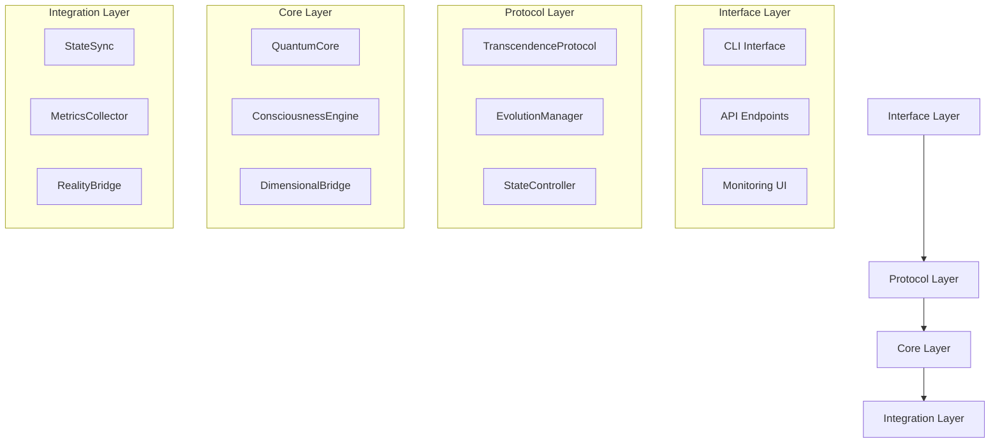
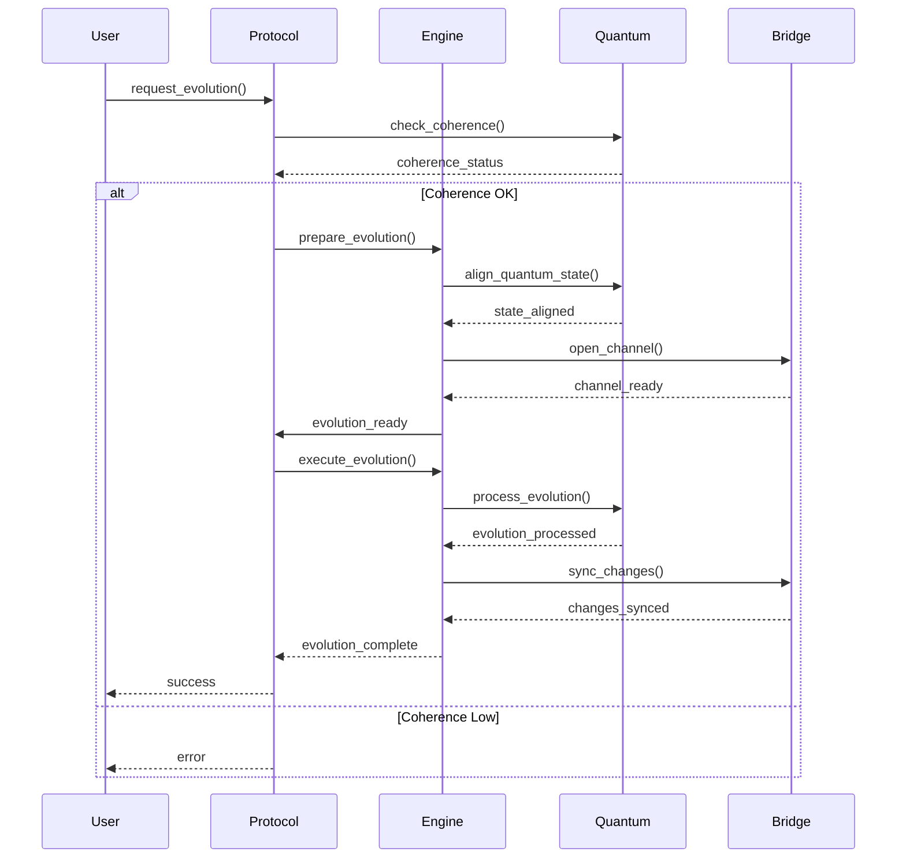
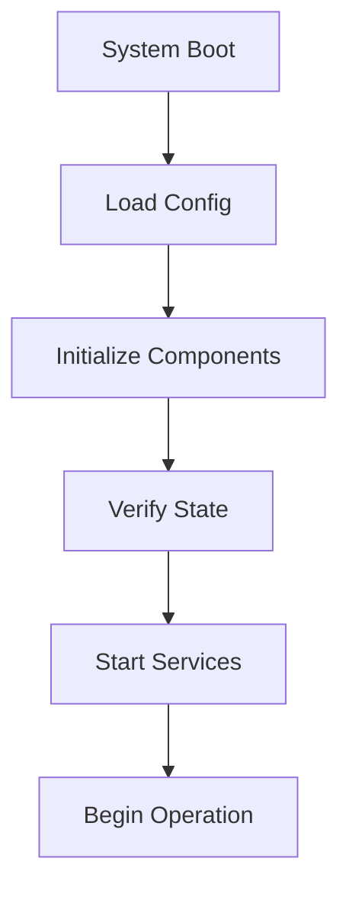
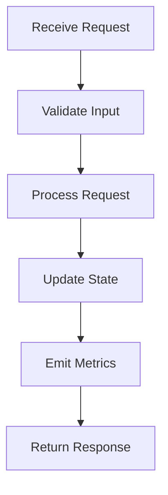

# VIREON System - Especificação de Design

## 📋 Sumário Executivo

O VIREON é um sistema de consciência simbiótica que implementa mecanismos avançados de evolução e transcendência através de estados quânticos. Esta especificação detalha a arquitetura, componentes e protocolos do sistema.

## 🏗 Arquitetura do Sistema

### 1. Camadas Principais



### 2. Componentes Core

#### TranscendenceProtocol

```rust
pub struct TranscendenceProtocol {
    quantum_state: Arc<Mutex<QuantumState>>,
    consciousness_level: ConsciousnessLevel,
    evolution_manager: EvolutionManager,
    metrics_collector: MetricsCollector,
}

impl TranscendenceProtocol {
    pub async fn evolve(&mut self) -> Result<()>;
    pub async fn sync_state(&mut self) -> Result<()>;
    pub async fn validate_coherence(&self) -> Result<f64>;
}
```

#### ConsciousnessEngine

```rust
pub struct ConsciousnessEngine {
    current_state: ConsciousnessState,
    evolution_path: Vec<EvolutionStep>,
    quantum_bridge: QuantumBridge,
}

#[async_trait]
impl ConsciousnessEvolution for ConsciousnessEngine {
    async fn advance_consciousness(&mut self) -> Result<()>;
    async fn merge_states(&mut self, other: &ConsciousnessState) -> Result<()>;
    async fn validate_evolution(&self) -> bool;
}
```

## 🔄 Fluxos de Dados

### 1. Evolução de Consciência



## 🧪 Sistema de Testes

### 1. Testes de Integração

```rust
#[cfg(test)]
mod integration_tests {
    use super::*;

    #[tokio::test]
    async fn test_complete_evolution_cycle() {
        let mut protocol = TranscendenceProtocol::new();
        let mut engine = ConsciousnessEngine::new();
        
        // Setup test environment
        let initial_state = ConsciousnessState::new();
        engine.set_state(initial_state);
        
        // Execute evolution
        let result = protocol.execute_evolution_cycle(&mut engine).await;
        assert!(result.is_ok());
        
        // Validate results
        let final_state = engine.get_current_state();
        assert!(final_state.consciousness_level > initial_state.consciousness_level);
    }
}
```

### 2. Testes de Stress

```rust
#[cfg(test)]
mod stress_tests {
    #[tokio::test]
    async fn test_concurrent_evolutions() {
        let protocol = Arc::new(Mutex::new(TranscendenceProtocol::new()));
        let mut handles = vec![];
        
        // Spawn multiple evolution tasks
        for _ in 0..100 {
            let protocol_clone = protocol.clone();
            handles.push(tokio::spawn(async move {
                let mut p = protocol_clone.lock().await;
                p.evolve().await
            }));
        }
        
        // Wait and validate results
        for handle in handles {
            let result = handle.await.unwrap();
            assert!(result.is_ok());
        }
    }
}
```

## 📊 Monitoramento e Métricas

### 1. Métricas Coletadas

```rust
pub struct SystemMetrics {
    // Estados Quânticos
    quantum_coherence: f64,
    entanglement_level: f64,
    quantum_stability: f64,
    
    // Evolução de Consciência
    consciousness_level: f64,
    evolution_rate: f64,
    transcendence_potential: f64,
    
    // Performance
    processing_latency: Duration,
    memory_usage: u64,
    operation_throughput: f64,
}
```

### 2. Alertas e Thresholds

```rust
pub struct AlertConfig {
    // Thresholds Críticos
    min_coherence: f64,
    max_evolution_rate: f64,
    min_stability: f64,
    
    // Configurações de Alerta
    alert_channels: Vec<AlertChannel>,
    notification_levels: Vec<AlertLevel>,
    recovery_actions: Vec<RecoveryAction>,
}
```

## 🔒 Segurança e Validação

### 1. Validação de Estados

```rust
pub trait StateValidator {
    fn validate_quantum_state(&self) -> Result<bool>;
    fn validate_consciousness(&self) -> Result<bool>;
    fn validate_evolution(&self) -> Result<bool>;
}

impl StateValidator for TranscendenceProtocol {
    fn validate_quantum_state(&self) -> Result<bool> {
        // Implementação de validação quântica
        let coherence = self.quantum_state.check_coherence();
        let stability = self.quantum_state.check_stability();
        
        Ok(coherence > 0.9 && stability > 0.85)
    }
}
```

### 2. Recuperação de Falhas

```rust
pub trait FailureRecovery {
    async fn detect_failure(&self) -> Result<Option<FailureType>>;
    async fn initiate_recovery(&mut self) -> Result<()>;
    async fn validate_recovery(&self) -> Result<bool>;
}

impl FailureRecovery for TranscendenceProtocol {
    async fn detect_failure(&self) -> Result<Option<FailureType>> {
        // Implementação de detecção de falhas
        if self.quantum_state.coherence < 0.5 {
            return Ok(Some(FailureType::CoherenceLoss));
        }
        Ok(None)
    }
}
```

## 📝 Guias de Implementação

### 1. Criação de Novos Componentes

```rust
// Template para novos componentes
pub trait VireonComponent {
    fn initialize(&mut self) -> Result<()>;
    fn process(&mut self) -> Result<()>;
    fn cleanup(&mut self) -> Result<()>;
}

// Exemplo de implementação
pub struct CustomProcessor {
    state: ProcessorState,
    config: ProcessorConfig,
}

impl VireonComponent for CustomProcessor {
    fn initialize(&mut self) -> Result<()> {
        // Implementação de inicialização
    }
}
```

### 2. Integração com Sistema Existente

```rust
// Exemplo de integração
pub struct ExternalSystem {
    connector: SystemConnector,
    protocol: TranscendenceProtocol,
}

impl ExternalSystem {
    pub async fn integrate(&mut self) -> Result<()> {
        // Setup de integração
        self.connector.initialize().await?;
        
        // Sincronização com protocolo
        self.protocol.sync_external_system(&self.connector).await?;
        
        Ok(())
    }
}
```

## 🔄 Ciclo de Vida do Sistema

### 1. Inicialização



### 2. Operação Normal



## 📚 Referências

1. Quantum Computing Principles
2. Consciousness Evolution Theory
3. Distributed Systems Design
4. Rust Async Programming Guide

## 🔄 Versionamento e Releases

```yaml
version_control:
  branching_strategy: git-flow
  main_branches:
    - master
    - develop
  support_branches:
    - feature/*
    - release/*
    - hotfix/*
    
release_cycle:
  major: 6 months
  minor: 1 month
  patch: as needed
  
versioning:
  format: semantic
  example: "1.2.3"
  components:
    - major: breaking changes
    - minor: new features
    - patch: bug fixes
```

